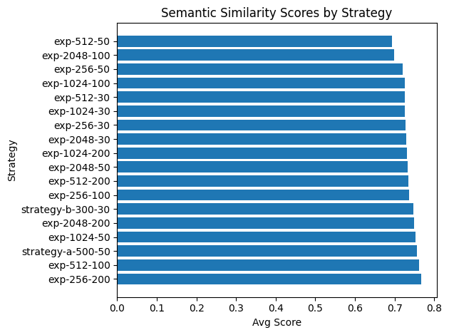
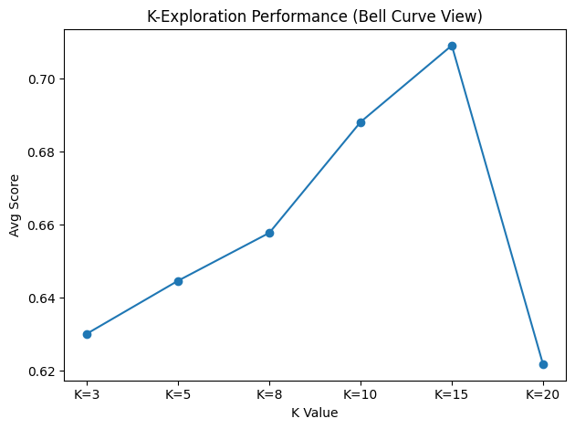

# RAG Optimization Engine: The "Data-Driven" Conclusion

## Introduction

Most RAG systems are built on gut feelings. An engineer picks chunk size 512, overlap 50, k=3 — maybe because they saw it in a tutorial, maybe because it "felt right", and ships it. Nobody really knows if those numbers are optimal. Nobody tests it.

I wanted to know if we could do better.

This project builds a fully automated RAG evaluation pipeline that runs a systematic grid search across 18 chunking strategies and 6 retrieval depths — nearly 2,000 evaluations in total — to find the configuration that actually performs best on your data. No guessing. No vibes. Just numbers.
The stack: Spring Boot, PostgreSQL with pgvector, and 100% open-source models via Ollama. Everything runs locally. No data leaves the machine, no API costs, no black boxes. The system generates its own "Golden Dataset" of 100 expert Q&A pairs to use as a benchmark, then scores every strategy against it using an LLM judge.

The short version of what we found: smaller chunks beat larger ones (sometimes dramatically), and there's a hard performance cliff when you give the model too much context. But the more interesting story is how we found it — and what it suggests about how careful you need to be when designing your evaluation methodology.

Here's how it works.

## Methodology

The pipeline has three stages: **Ingestion, Golden Dataset Creation**, and **Evaluation**.  Let's go ahead and walk through each one.

### INGESTION

The first step is generating all the chunking strategies we want to test.  One API call kicks off the process: 

```bash
time curl -X POST "http://localhost:8081/api/eval/explore?directoryPath=/home/dell-linux-dev3/Projects/ragops-eval-springBoot/data"
Exploration started for 16 combinations. Watch logs for progress.
real	0m0.012s
user	0m0.003s
sys	0m0.004s

```
That returns almost instantly, but don't let the 0.12s fool you.  It is running in the background.  You can watch the strategies populate in Postgres as they are created.

Monitor it like so:
```bash
docker exec -it ragops-postgres psql -U ragops -d ragops -c "SELECT name, chunk_size, overlap FROM rag_strategies;"
     name     | chunk_size | overlap 
--------------+------------+---------
 exp-256-30   |        256 |      30
 exp-256-50   |        256 |      50
 exp-256-100  |        256 |     100
 exp-256-200  |        256 |     200
 exp-512-30   |        512 |      30
 exp-512-50   |        512 |      50
 exp-512-100  |        512 |     100
 exp-512-200  |        512 |     200
 exp-1024-30  |       1024 |      30
 exp-1024-50  |       1024 |      50
 exp-1024-100 |       1024 |     100
 exp-1024-200 |       1024 |     200
 exp-2048-30  |       2048 |      30
 exp-2048-50  |       2048 |      50
 exp-2048-100 |       2048 |     100
 exp-2048-200 |       2048 |     200
(16 rows)

```
This gives us a 4x4 grid: chunk sizes of 256, 512, 1024, and 2048, each paired with overlaps of 30, 50, 100, and 200. That's 16 competitors out of the box.

I also wanted to include two strategies from an earlier naive run,one of which had actually won that round, so I added them manually:
```bash
 docker exec -it ragops-postgres psql -U ragops -d ragops -c "INSERT INTO rag_strategies (name, chunk_size, overlap, k_value) VALUES ('strategy-a-500-50', 500, 50, 5), ('strategy-b-300-30', 300, 30, 5);"

```
Quick sanity check:

```bash
docker exec -it ragops-postgres psql -U ragops -d ragops -c "SELECT COUNT(*) FROM rag_strategies;"
 count 
-------
    18
(1 row)

```

18 strategies confirmed. Each one will get its own complete index of our source documents, resulting in over 50,000 unique vector embeddings across the board. We're deliberately holding k-value fixed for now and testing it separately in a second pass — combining both dimensions in one grid search would multiply the analysis time significantly.

Next up: building the exam that all 18 strategies will be tested against. 


### GOLDEN DATA SET CREATION

To grade a RAG system, you need a "Gold Standard" — a fixed set of questions with known correct answers that you can run against every strategy under identical conditions. Without this, you're just vibes-checking outputs with no way to compare fairly.
My engine uses Llama 3.1 as a "Teacher" LLM: it reads the source documents and autonomously generates 100 expert question-and-answer pairs. One call kicks it off:
```bash
time curl -X POST "http://localhost:8081/api/eval/generate-dataset?directoryPath=/home/dell-linux-dev3/Projects/ragops-eval-springBoot/data&count=100"
Generated 100 golden dataset entries.
real	18m47.908s
user	0m0.026s
sys	0m0.059s
```
Nearly 19 minutes on a laptop GPU. This is one of the more obvious candidates for parallelization, and distributing it across machines is on the to-do list. For now, you can watch progress while you wait:

```bash 
$docker exec -it ragops-postgres psql -U ragops -d ragops -c "SELECT COUNT(*) FROM rag_strategies;"
 count 
    18    <--still cooking...
(1 row)
----
$ docker exec -it ragops-postgres psql -U ragops -d ragops -c "SELECT COUNT(*) FROM golden_dataset;"
 count 

    36    <--still cooking...
(1 row)
----
$ docker exec -it ragops-postgres psql -U ragops -d ragops -c "SELECT COUNT(*) FROM golden_dataset;"
 count 

   100    <--done.
(1 row)
----
```

OK! Finally we have our 100 prompt/result pairs!  

Here is what two entries actually look like:

```bash

docker exec -it ragops-postgres psql -U ragops -d ragops -c "\x" -c "SELECT prompt, expected_answer FROM
     golden_dataset LIMIT 2;"
Expanded display is on.

-[ RECORD 1 ]---

prompt          | What new features and changes have been added to Docker since its initial release, according to the updated guide "Docker: Up & Running"?
expected_answer | The updated guide includes updates that reflect the substantial changes made to Docker since its initial release nearly a decade ago. Specifically, it covers BuildKit, multi-architecture image support, rootless containers, and much more, as revised by authors Sean Kane and Karl Matthias to reflect best practices and provide additional coverage of these new features.

-[ RECORD 2 ]---
prompt          | What kind of book is Docker: Up & Running according to the endorsements provided?
expected_answer | According to Kelsey Hightower, Principal Developer Advocate at Google Cloud Platform, "Docker: Up & Running moves past the Docker honeymoon and prepares you for the realities of running containers in production." Liz Rice, Chief Open Source Officer with eBPF specialists Isovalent, describes it as taking users from "the basics underlying concepts to invaluable practical lessons learned from running Docker at scale." Additionally, Mihai Todor, Senior Principal Engineer at TLCP, states that the book will help users build "modern, reliable, and highly available distributed systems." These endorsements suggest that Docker: Up & Running is a comprehensive guide for those looking to gain hands-on experience with Docker and containers in real-world scenarios.


```

Honestly, those first two are a bit soft — they're pulling from the book's front matter rather than its technical content. It's worth spot-checking the full dataset to make sure you have enough meaty technical questions in the mix. The quality of your golden dataset directly determines the quality of your evaluation, so this step deserves more attention than it might seem.


### EVALUATION

Finally, the secret sauce! This is where it all comes together. We have our vector DB, our golden dataset, and an LLM judge. Time to run:

```bash
time curl -X POST "http://localhost:8081/api/eval/run-all"
{"status":"Evaluation triggered for 18 strategies"}
real	476m17.322s
user	0m0.897s
sys	0m1.092s
```
Yikes.   That is a long time.  Nearly 8 hours, running overnight on a laptop. Every time I see that number my first thought is "how do I distribute this across multiple machines", and that's firmly on the to-do list. For now, you can monitor progress while it runs:

You can monitor the results in a couple ways.

Just a number:
```bash
docker exec -it ragops-postgres psql -U ragops -d ragops -c "SELECT COUNT(*) FROM evaluation_results;"
 count 
-------
   248
(1 row)
```

and by group:

```bash 

docker exec -it ragops-postgres psql -U ragops -d ragops -c "SELECT s.name, COUNT(er.id) FROM evaluation_results er
     JOIN rag_strategies s ON er.strategy_id = s.id GROUP BY s.name ORDER BY 2 DESC;"
    name     | count 
-------------+-------
 exp-256-30  |   101
 exp-256-100 |   101
 exp-256-50  |   101
 exp-256-200 |    53
(4 rows)
```
You can also look at the current smimilarity, and this will change as more results get indexed:

```
docker exec -it ragops-postgres psql -U ragops -d ragops -c "SELECT s.name, AVG(er.score) as avg_similarity, COUNT(er.id) as question_count FROM evaluation_results er JOIN rag_strategies s ON er.strategy_id = s.id WHERE er.metric_type = 'SEMANTIC_SIMILARITY' GROUP BY s.name ORDER BY 2 DESC;"
       name        |     avg_similarity     | question_count 
-------------------+------------------------+----------------
 exp-256-200       | 0.76760000000000000000 |            100
 exp-512-100       | 0.76190000000000000000 |            100
 strategy-a-500-50 | 0.75690000000000000000 |            100
 exp-1024-50       | 0.75220000000000000000 |            100
 exp-2048-200      | 0.74860000000000000000 |            100
 ...
 exp-2048-100      | 0.69870000000000000000 |            100
 exp-512-50        | 0.69370000000000000000 |            100
(18 rows)


```

Strategy '256-200' is our winner — 256-character chunks with a 200-character overlap. Notably, this contradicts the naive run from earlier, where a 500-char chunk strategy took the top spot. The difference came down to how the golden dataset was constructed, which is worth flagging: your evaluation is only as good as your benchmark. More on that in the conclusion.
#### K Value exploration

So you gotta get the id of the winning strategy:

```bash

docker exec -it ragops-postgres psql -U ragops -d ragops -c "SELECT id FROM rag_strategies WHERE name = 'exp-256-200'";
                  id                  
--------------------------------------
 19fa033d-01cb-4b76-bbe4-b7804fc4a5fd

```
You need this to run the k-value portion of the grid search:

```bash
 curl -X POST "http://localhost:8081/api/eval/explore-k/19fa033d-01cb-4b76-bbe4-b7804fc4a5fd"
K-Value Exploration started for values: [3, 5, 8, 10, 15, 20]. Watch logs for progress.
```
This takes about an hour or so. 

You can monitor it like so:

```
docker exec -it ragops-postgres psql -U ragops -d ragops -c "SELECT metric_type, COUNT(*) FROM evaluation_results WHERE metric_type LIKE 'K_EXPLORATION%' GROUP BY metric_type ORDER BY 1;"
   metric_type    | count 
------------------+-------
 K_EXPLORATION_K3 |     8
(1 row)


```

and like this:
```
 docker exec -it ragops-postgres psql -U ragops -d ragops -c "SELECT metric_type, COUNT(*) FROM evaluation_results GROUP BY metric_type;"
     metric_type     | count 
---------------------+-------
 K_EXPLORATION_K5    |    29
 K_EXPLORATION_K3    |   100
 SEMANTIC_SIMILARITY |  1800
 HIT_RATE            |    18

```

and  more importanatly watching the avg_similarity rise and hopefully fall:

```
docker exec -it ragops-postgres psql -U ragops -d ragops -c "SELECT metric_type, AVG(score) as avg_similarity,
     COUNT(*) as question_count FROM evaluation_results WHERE metric_type LIKE 'K_EXPLORATION%' GROUP BY metric_type
     ORDER BY metric_type;"
    metric_type    |     avg_similarity     | question_count 
-------------------+------------------------+----------------
 K_EXPLORATION_K10 | 0.68813000000000000000 |            100
 K_EXPLORATION_K15 | 0.70907000000000000000 |            100
 K_EXPLORATION_K20 | 0.62180000000000000000 |            100
 K_EXPLORATION_K3  | 0.63020000000000000000 |            100
 K_EXPLORATION_K5  | 0.64470000000000000000 |            100
 K_EXPLORATION_K8  | 0.65780000000000000000 |            100

```
There's a clear bell curve here with a peak at K=15. Performance climbs steadily from K=3 through K=15, then drops sharply at K=20. That's not a gradual decline — it's a cliff. We'll dig into what that means in the conclusion.

A more precise search could run every integer between 2 and 20, or use a binary search-style approach to home in on the peak with fewer evaluations. For now, we have enough to draw a clear conclusion.


### LeaderBoard Reveal 

After 1,800 evaluations across 18 strategies, here's what the data shows.


**Semantic Similarity by Strategy**



exp-256-200 takes the top spot with a score of 0.7676, edging out exp-512-100 (0.7619) and strategy-a-500-50 (0.7569). A few things stand out:

The spread between first and last (0.7676 vs 0.6937) is wider than it looks — at this scale, that gap meaningfully affects answer quality across 100 questions.
Chunk size 512 is notably inconsistent: exp-512-100 finishes 2nd, but exp-512-50 finishes dead last. Overlap matters as much as size.
Larger chunks (2048) cluster in the middle of the pack — more context per chunk doesn't help, and in some cases hurts.

**K-Value Exploration (exp-256-200)**


The bell curve is unmistakable. Scores climb steadily from K=3 through K=15, then collapse at K=20. That drop isn't gradual — it's a 13% fall in a single step, which tells us something important: past a certain threshold, additional context becomes noise, and the model's ability to reason over it degrades fast.

K=15 is our optimum for this strategy and dataset. A finer-grained search between K=10 and K=20 would likely find a sharper peak, but the shape of the curve makes it clear we're in the right neighborhood.

One thing worth noting from the hit rate data: strategy-a-500-50 actually leads on hit rate (0.97) despite finishing 3rd on semantic similarity. Hit rate measures whether the right chunks were retrieved; semantic similarity measures whether the answer was good. They're related but not the same, and the gap between them is a reminder that retrieval quality and generation quality don't always move together.

### CONCLUSION

Three findings stood out from the data.

**Small chunks won, but the reason matters.** The 256-character chunk with 200-character overlap came out on top, which contradicted our naive run where a 500-character strategy won. The difference came down to how the golden dataset was constructed: in the naive run, we generated separate datasets per book; here we generated one combined dataset across both. We don't know exactly why that changes the outcome, but it does — and it's a reminder that your evaluation methodology shapes your results as much as your chunking strategy does. Be deliberate about how you build your golden dataset.

**Retrieval depth has a sweet spot.** Accuracy climbed steadily from K=3 to K=15, peaking at a semantic score of 0.71. We tested six discrete values, so the true optimum might be K=16 or K=17 — a finer-grained search or a binary search-style approach would pin it down more precisely. That's on the roadmap.


**More context can actively hurt.** The most striking finding: jumping from K=15 to K=20 tanked accuracy by 13% in a single step. This isn't a gradual decline — it's a cliff. Past a certain threshold, the additional chunks aren't adding signal, they're adding noise, and the model's reasoning degrades fast. "More data" is not the same as "better data."

The system works. The next step is making it faster — distributing the evaluation workload across machines would cut that 8-hour run down to something far more practical, and open the door to more exhaustive grid searches.


